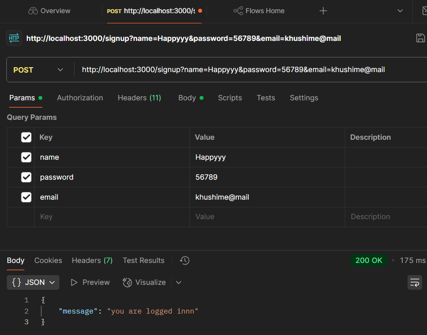
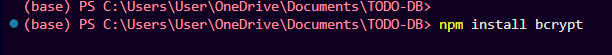
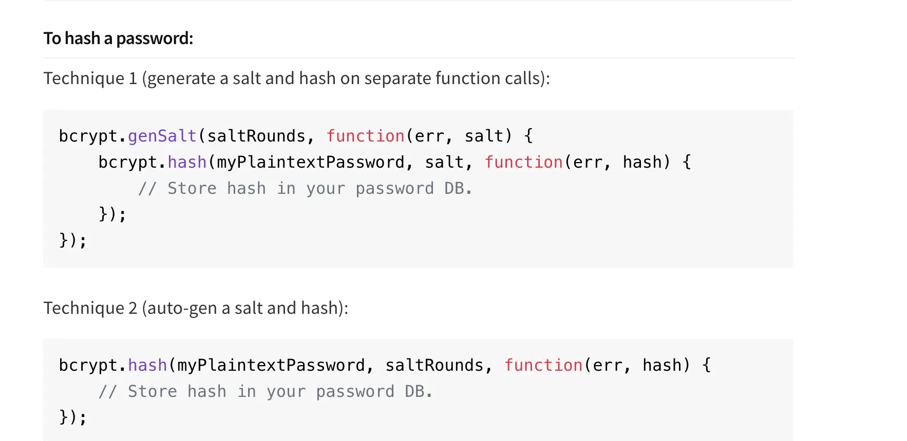
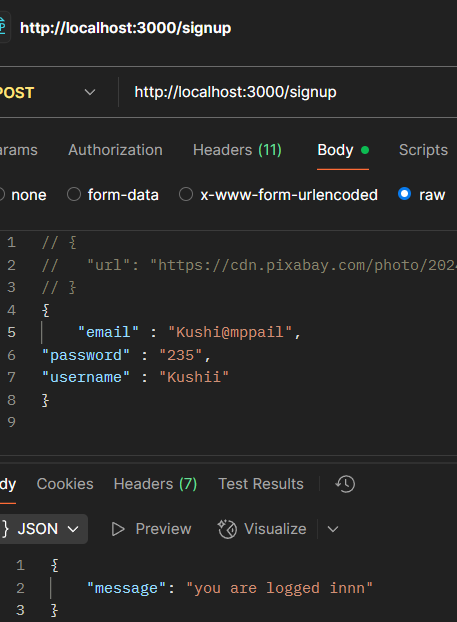
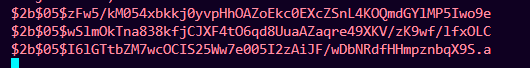
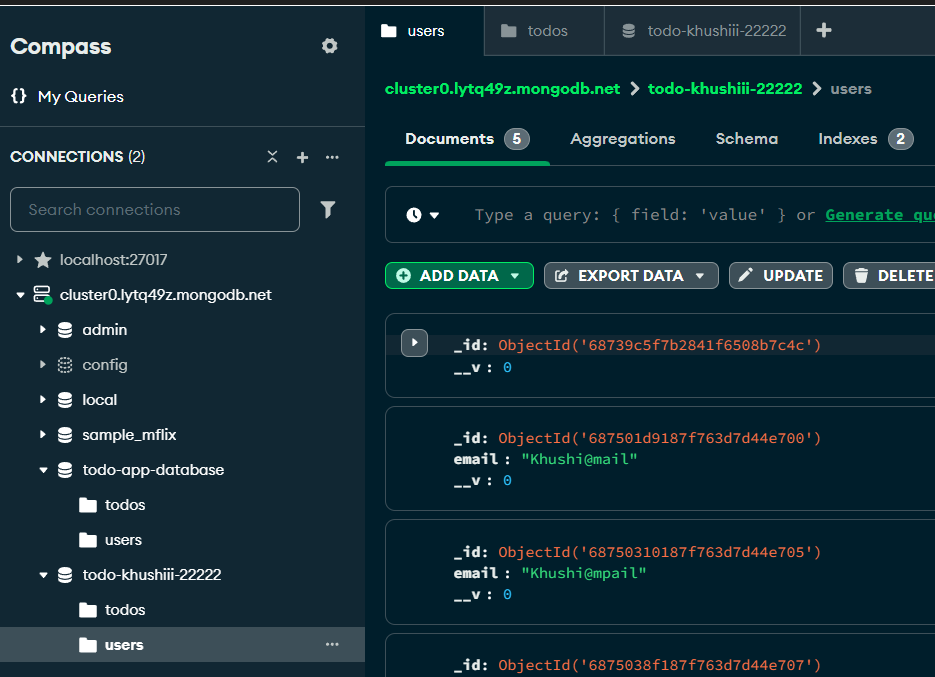
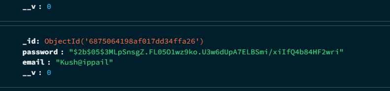
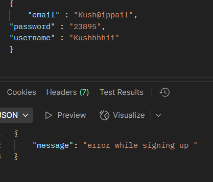

# TODO-DB

Lets now create a todo application with the data being persisted in the database.
Initialise a new Node.js project
`npm init -y`
​
Install dependencies
`npm install express mongoose`

- Create the skeleton for 4 routes
    - POST /signup
    - POST /login
    - POST /todo (authenticated)
    - GET /todos (authenticated)

- Initialize the schema of your app in a new file (db.js)
https://www.npmjs.com/package/mongoose

i have already installed mangodb and compass and created a cluster as well as inserted the document in it ... a todo whre i ahve user and todos database i gonna use it in db.js file 


Import the model in index.js
```jsx 
const { UserModel, TodoModel } = require("./db");```

```

Succcesssfullll : - 


--Implement the auth middleware (in a new file auth.js)

---Hashing password
why ??? in past big basket , paytm and many other platforms where hacked and in there database credentials a person can see there password in the user area... 
like my ex girlfrind password is this... so most probably other platforms wil be having the same password cause people do have tendency to use the same passwrod...
here comes hashing password : - 

## Why should you hash passwords?

Password hashing is a technique used to securely store passwords in a way that makes them difficult to recover or misuse. Instead of storing the actual password, you store a hashed version of it.

- salt , bcrypt are some of the ways to do that...

-- Adding password encryption:- 

so the structure will be : - when the user sends ths password in the backend it will be plain password but in the DB it will be hashed password and while signin we can reverse it..

-- if poeple have same password (hash) : - we need to ensure there password is different in hash .... using salting now

https://heynode.com/blog/2020-04/salt-and-hash-passwords-bcrypt/ found this u guys can check the hashing salt and becrypt here...

install bcrypt : - https://www.npmjs.com/package/bcrypt


go to the doc and read a bit ... 

let's go with 2nd approach here 

postman 
 giving values 

Hash passwords

and mangoDB auto updates : - 


SIlly mistake i did : - DB was showing only email not password all becausee i was in db.js user schema section was sending Password but it should be password 
Finally after correcting that : - 
feeling relaxed ....

# Error handling

Right now, the server crashes if you sign up using duplicate email

How can you fix this?
--Approach #1 - Try catch
In JavaScript, a try...catch block is used for handling exceptions and errors that occur during the execution of code. It allows you to write code that can manage errors gracefully rather than crashing the application or causing unexpected behavior.

---- 
Doneeee Yayyy finally....

Your server should be smart enough to chcek that # Input validationf 
A external library which will be do this work for me....

In TypeScript, Zod is a library used for schema validation and parsing. It's designed to help developers define, validate, and manage data structures in a type-safe manner. 

Docs - https://zod.dev/ 
- install it 
`npm install zod`