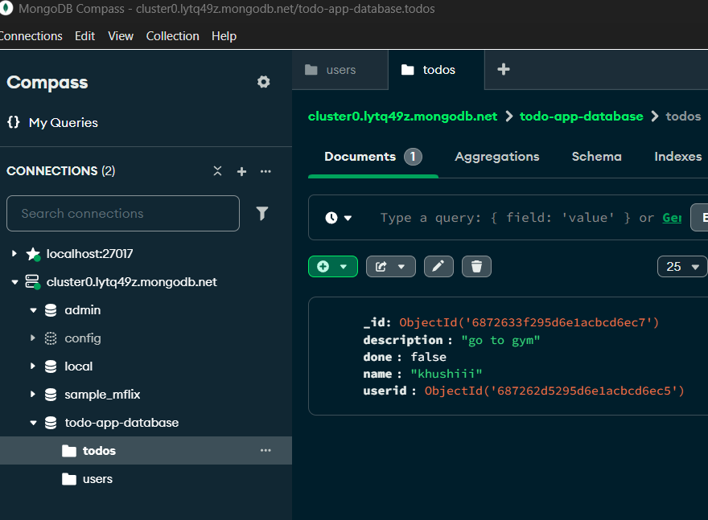

# TODO-DB

Lets now create a todo application with the data being persisted in the database.
Initialise a new Node.js project
`npm init -y`
​
Install dependencies
`npm install express mongoose`

- Create the skeleton for 4 routes
    - POST /signup
    - POST /login
    - POST /todo (authenticated)
    - GET /todos (authenticated)

- Initialize the schema of your app in a new file (db.js)
https://www.npmjs.com/package/mongoose

i have already installed mangodb and compass and created a cluster as well as inserted the document in it ... a todo whre i ahve user and todos database i gonna use it in db.js file 

